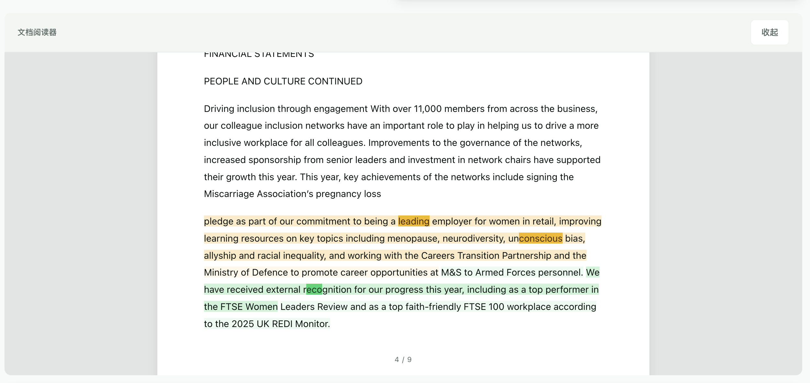

# Greenwashing Lens

> **AI 驱动的企业绿色声明风险检测平台** —— 上传 ESG 报告或粘贴绿色营销文本，自动识别 greenwashing（洗绿）风险。基于学术金融语言学框架，结合规则引擎、NLP 情绪分析与多模型 LLM（OpenAI / Claude / Gemini / DeepSeek），提供从模糊表述检测到合规改写建议的全链路审计。内置 PDF 文档阅读器，支持原文高亮与页码溯源。支持中英文双语，打包为 macOS / Windows 桌面应用，双击即用。
>
> **AI-powered greenwashing risk detection for corporate sustainability claims.** Upload ESG reports or paste green marketing copy to automatically identify greenwashing risks. Built on an academic financial-linguistics framework, combining a rule engine, NLP sentiment analysis, and multi-model LLM support (OpenAI / Claude / Gemini / DeepSeek) — covering everything from vague-language detection to compliant rewrite suggestions. Includes a built-in PDF reader with keyword highlighting and page-origin tracing. Bilingual (Chinese / English), packaged as a native macOS / Windows desktop app — just double-click to run.

当前版本 / Current version：`0.9.1`

> **🚧 项目持续迭代中** —— 多项功能正在快速完善，包括证据核验引擎、多层级检测模型与合规报告导出。欢迎感兴趣的伙伴交流探讨、提出建议或参与协作，请联系：**[xilai529@gmail.com](mailto:xilai529@gmail.com)**
>
> **🚧 Actively developed** — Evidence verification engine, multi-tier detection models, and compliance report export are in progress. Interested in collaborating or have suggestions? Reach out: **[xilai529@gmail.com](mailto:xilai529@gmail.com)**

## 最近更新 / Changelog

### 2026-05-21
- **双模型分工分析**：配置主要 + 次要 Provider 后，文本自动按位置拆分为两段，由两个模型并行分析，结果按文本长度加权合并；任一未配置自动降级为单模型
  **Dual-model split analysis**：configure a primary and secondary LLM — text is split at a natural boundary and analyzed in parallel, results merged by weighted text length; gracefully falls back to single-model if one side is unconfigured
- **中英文双语 UI**：全界面支持中/英一键切换（TopBar 语言切换按钮），所有静态与动态文本均已 i18n 化，偏好持久化到 localStorage
  **Bilingual UI (ZH/EN)**：full interface switches between Chinese and English via a TopBar toggle; all static and dynamic text is i18n-aware, preference saved to localStorage
- **设置界面新增次要 Provider**：抽屉中添加「次要 Provider」单选组，双模型分工可直接在界面内配置
  **Settings — secondary provider**：added secondary provider radio group; dual-model split is fully configurable from the in-app settings UI
- **全面 UI/UX 改版**：40+ 处硬编码颜色替换为 CSS 变量，深色模式全面适配；主按钮深色下改用品牌色（teal）；原生 select 加 `color-scheme: dark`；新增全局 `button:focus-visible` 焦点环；v2 深度分析动态组件补全样式；修复平板端列溢出
  **Comprehensive UI/UX pass**：40+ hardcoded colors replaced with CSS variables; primary button uses brand teal in dark mode; native selects inherit dark theme via `color-scheme`; global `button:focus-visible` ring added; all v2 dynamic components styled; tablet column overflow fixed
- **Tab 输入切换布局**：PDF 上传与文本粘贴改为 Tab 标签切换（全宽文本框）；PDF 提取完成后自动切回文本 Tab；三行按钮行合并为单行
  **Tab-based input layout**：PDF upload and text paste switch via pill tabs (full-width textarea); auto-switches to text tab after PDF extraction; three button rows merged into one
- **单列布局**：输入和检测结果从左右双列改为纵向单列，消除右侧大面积留白
  **Single-column layout**：workspace changed from two-column grid to full-width stacked layout, eliminating blank space
- **LLM 缓存修复**：缓存原先只写不读，已修复为先查缓存再发请求（5 分钟 TTL）；API 失败时新增服务端 `console.error` 日志
  **LLM cache fix**：cache was write-only; now checks for a hit before making an API call (5-minute TTL); server-side error logging added on API failure
- **修复 ASAR 模块缺失导致应用无法启动**：`greenwashing-engine.js` 在重命名后未打入 ASAR，导致启动崩溃，已修复
  **Fix missing module crash**：`greenwashing-engine.js` was absent from ASAR after a project rename; fixed
- **修复 Electron spawn ENOTDIR 崩溃**：ASAR 路径守护防止虚拟文件路径被传入 OS spawn
  **Fix spawn ENOTDIR crash**：ASAR path guard prevents virtual paths from being passed to OS-level spawn

### 2026-05-20
- **PDF 阅读器主题适配**：工具栏与页面卡片全面切换为 CSS 变量，随系统亮色/暗色模式自动切换，不再固定显示深色
  **PDF reader theme**：toolbar and page cards now use CSS variables, automatically following system light/dark mode
- **PDF 阅读器页码溯源**：抽取时按换页符（form feed）解析原始 PDF 页码，阅读器中每段内容前显示「第 X 页」标签，清晰对应原文位置
  **PDF page-origin markers**：raw text is split on form-feed characters to recover original PDF page numbers; a "Page X" badge is shown before each content block in the reader
- **PDF 文字碎片修复**：移除 `pdftotext -layout` 标志，改用默认阅读顺序模式，大幅减少多栏 PDF 的字母乱序与断行碎片
  **PDF text defragmentation**：removed the `pdftotext -layout` flag; default reading-order mode greatly reduces garbled letters and broken lines in multi-column PDFs
- **修复分析进度界面多余圆形**：分析进行中的 loading 骨架圆圈与真实 gauge 重叠，已隐藏冗余的 `score-skeleton`
  **Fix duplicate loading circle**：hid the redundant `score-skeleton` that overlapped with the live gauge during analysis

### 2026-05-19
- **文档阅读器重构**：升级为内嵌滚动式 PDF 风格阅读器，上传后自动展开，不再需要手动点击"打开"
  **Document reader overhaul**：upgraded to an inline scrollable PDF-style reader that auto-expands on upload — no more manual "Open" click required
- **PDF 上传交互修复**：将"打开阅读器"按钮移出上传区域，解决点击被拦截的问题
  **PDF upload UX fix**：moved the "Open reader" button outside the drop zone to prevent click interception

## 主要功能 / Features

- **桌面壳 / Desktop shell**：Electron 原生窗口，双击即可打开，不需要手动开浏览器 — Native Electron window, no browser required
- **后端服务 / Backend**：内置 HTTP 服务，Electron 启动时自动绑定随机空闲端口 — Embedded HTTP server, automatically binds a free port on startup
- **PDF 文档阅读器 / PDF reader**：上传报告后自动打开，支持原文高亮（绿色声明、模糊表述、绝对断言、未来承诺）和原始 PDF 页码标记 — Auto-opens on upload; highlights green claims, vague language, absolute assertions, and future commitments; shows original PDF page numbers
- **历史记录 / History**：SQLite，本地长期保存，默认保留 2 年 — SQLite-backed local storage, 2-year retention by default
- **规则引擎 / Rule engine**：前后端共用一套 `src/engine-core.js` — Shared front-end / back-end scoring core
- **双语界面 / Bilingual UI**：中文/英文一键切换，偏好持久化 — Chinese/English toggle, preference persisted to localStorage
- **外部模型 / LLM support**：支持 `openai`、`claude`、`gemini`、`deepseek`，可配置双模型并行分工分析 — OpenAI, Claude, Gemini, DeepSeek; dual-model split analysis supported
- **NLP 子服务 / NLP service**：可选 Python 服务，提供 Layer 2 情绪检测增强 — Optional Python sidecar for Layer 2 sentiment enhancement
- **证据核验引擎 / Evidence engine**：可选 Python 子服务（端口 5176），基于 Gemini File Search 对上传的 ESG/CSR 报告做 L1-L4 流水线（索引 → 抽声明 → 多查询检索 → 裁定）。详见 [`evidence-engine/README.md`](evidence-engine/README.md)。
  Optional Python sidecar (port 5176) running a Gemini File Search L1–L4 pipeline (index → extract claims → multi-query retrieval → verdict) over uploaded ESG/CSR reports. See [`evidence-engine/README.md`](evidence-engine/README.md).

## 检测模型规划 / Detection Model Roadmap

完整的多层级检测模型设计见 [`docs/greenwashing-detection-plan.md`](docs/greenwashing-detection-plan.md)（包含 greenwashing 概念调研、7 Sins / EU ECGT 监管对位、8 层架构、数据需求清单、实施路线图）。

Full multi-tier detection model design in [`docs/greenwashing-detection-plan.md`](docs/greenwashing-detection-plan.md) — covers greenwashing taxonomy, 7 Sins / EU ECGT regulatory mapping, 8-layer architecture, data requirements, and implementation roadmap.

### Stage 1 已落地的多层 API / Deployed multi-layer API（`/api/v2/analyze`）

```bash
curl -X POST http://127.0.0.1:5173/api/v2/analyze \
  -H "Content-Type: application/json" \
  -d '{"text":"Scope 1 emissions cut 33% vs 2017 by 2030.","mode":"standard"}'
```

返回 per-claim 结构化数据：每个原子声明带 `features`（Layer 1 词典命中向量）+ `structure`（Layer 3 解析出的 metric/scope/baseline/time_horizon）。模式 `fast` 跳过 Layer 3（不打 LLM，~3 秒）；`standard` 全跑（~5 秒）。

Returns per-claim structured data: each atomic claim carries `features` (Layer 1 dictionary hit vector) + `structure` (Layer 3 parsed metric / scope / baseline / time_horizon). Mode `fast` skips Layer 3 (no LLM call, ~3 s); `standard` runs all layers (~5 s).

v1 `/api/analyze` 保留不动，前端继续工作。等 Stage 2-3 完成后再做 UI 迁移。
The v1 `/api/analyze` endpoint is preserved; the existing frontend continues to use it. UI migration will follow once Stage 2–3 are complete.

## 功能展示 / Feature Screenshots

### 主界面 — 文本与 PDF 输入 / Home — Text & PDF Input

*支持粘贴绿色声明文本或上传 PDF 报告，自动识别语言、场景与行业分类*
*Paste green-claim text or upload a PDF report; language, context type, and industry are auto-detected*

### 分析结果 — 风险评分与概要 / Analysis Results — Risk Score Overview

*AI 驱动的 Greenwashing 风险概率评分（0–100%），包含模糊表述、证据缺口、夸大风险、承诺落差四个维度*
*AI-driven greenwashing risk score (0–100%) across four dimensions: vague language, evidence gap, exaggeration risk, and commitment shortfall*

### 风险维度分解与证据标记 / Risk Breakdown & Evidence Indicators

*四个风险维度的量化分解 + 五项证据指标（量化指标、时间边界、外部证明、行动证据、范围/基准）*
*Quantified breakdown across four risk dimensions + five evidence indicators (quantified metrics, time boundaries, external proof, action evidence, scope/baseline)*

### 三层情绪检测 / Three-Layer Sentiment Detection

*规则引擎 + NLP + LLM 三层情绪融合检测，一致性校验，分歧预警*
*Rule engine + NLP + LLM three-layer sentiment fusion, consistency check, and divergence alerts*

### LLM 增强判断 / LLM-Enhanced Analysis

*外部模型（支持 OpenAI / Claude / Gemini / DeepSeek）提供模糊表述诊断、逻辑矛盾检测与合规改写建议*
*External LLM (OpenAI / Claude / Gemini / DeepSeek) provides vague-language diagnostics, logical-contradiction detection, and compliant rewrite suggestions*

### 结果自检 / Result Self-Verification

*自动校验分析结果的一致性，包括自动识别可信度、外部模型幻觉检测等*
*Automatic consistency check on analysis results, including confidence assessment and LLM hallucination detection*

### 检测历史与趋势 / Detection History & Trends

*本地 SQLite 存储所有分析历史，支持风险评分趋势图与移动平均线*
*All analysis history stored locally in SQLite, with risk score trend chart and moving-average line*

### 暗色模式 / Dark Mode
  
*支持亮色/暗色模式一键切换，自动跟随系统偏好*
*One-click light/dark mode toggle that also follows system preference automatically*

### PDF 文档阅读器 / PDF Document Reader

*内嵌滚动式阅读器，上传报告后自动展开；关键词自动高亮（绿色声明、模糊表述、绝对断言、未来承诺），每段内容标注原始 PDF 页码*
*Inline scrollable reader that auto-opens on upload; keywords are color-highlighted by type (green claims, vague language, absolute assertions, future commitments), and every block is tagged with its original PDF page number*

---

## 开发运行 / Development

先安装依赖，然后启动开发服务 / Install dependencies and start the dev server:

```bash
npm install
npm start
```

注意：项目路径中不要包含空格（如 `New project`），否则 native module 编译可能报错。建议使用 `greenwashing-lens` 这样的目录名。
Note: avoid spaces in the project path (e.g. `New project`) — native module compilation may fail. Use a path like `greenwashing-lens` instead.

默认地址 / Default URL:

```text
http://127.0.0.1:5173
```

如果你想直接启动桌面窗口 / To launch the desktop window directly:

```bash
npm run desktop:start
```

## 打包桌面应用 / Packaging the Desktop App

生成打包目录（不产出安装包）/ Build directory only (no installer):

```bash
npm run build
```

生成可分发安装包 / Build distributable installer:

```bash
npm run package
```

输出目录 / Output directory:

```text
dist/
```

目标产物 / Artifacts:

- Windows：NSIS 安装包（`.exe`）/ NSIS installer
- macOS：磁盘镜像（`.dmg`）/ Disk image

## 历史记录存储 / History Storage

开发模式下，如果没有 Electron，SQLite 默认放在项目目录 / In dev mode without Electron, SQLite is stored in the project directory:

```text
data/history.sqlite
```

桌面应用模式下，SQLite 会自动放到系统用户数据目录 / In desktop app mode, SQLite is stored in the system user-data directory:

- macOS：`~/Library/Application Support/Greenwashing Lens`
- Windows：`%APPDATA%\\Greenwashing Lens`

首次启动时会自动尝试迁移旧版 `history.json` 数据。
On first launch, legacy `history.json` data is migrated automatically.

## 项目结构 / Project Structure

```text
electron/main.js                 桌面应用入口 / Desktop entry point
public/                          前端界面与离线资源 / Frontend UI & offline assets
src/api-router.js                API 路由 / API router
src/analysis-jobs.js             异步分析任务与 stalled 状态 / Async analysis jobs
src/engine-core.js               前后端共用评分核心 / Shared scoring core
src/greenwashing-engine.js       后端评分引擎封装 / Backend engine wrapper
src/history-store.js             SQLite 历史存储 / SQLite history store
src/text-classifier.js           中英文语言/场景/行业识别 / Language, context & sector classifier
src/services/analysis-service.js 分析编排服务 / Analysis orchestration
src/services/llm-service.js      外部模型适配器 / LLM provider adapter
src/services/nlp-service-client.js Python NLP 子服务客户端 / NLP sidecar client
src/services/emotion-fusion.js   三层情绪分数融合 / Three-layer emotion fusion
nlp-service/                     可选 Python NLP 子服务 / Optional Python NLP sidecar
server.js                        开发服务入口 / Dev server entry
scripts/generate-icon-png.js     PNG/ICO/ICNS 图标生成 / Icon generator
test/engine.test.js              核心规则测试 / Core rule tests
```

## API 概览 / API Overview

- `GET /api/health`
- `GET /api/v1/health`
- `POST /api/analyze`
- `POST /api/v1/analyze`
- `POST /api/v1/classify`
- `POST /api/v1/llm/test`
- `POST /api/v1/analyze-jobs`
- `GET /api/v1/analyze-jobs/:id`
- `POST /api/v1/history/summary`
- `POST /api/v1/upload-pdf`
- `GET /api/history`
- `DELETE /api/history`

详细字段见 / Full field reference:

- [API 文档 / API Docs](docs/API.md)
- [部署文档 / Deployment Guide](docs/DEPLOYMENT.md)

## 外部模型配置 / LLM Configuration

复制 `.env.example` 为 `.env`，再按需要填写 / Copy `.env.example` to `.env` and fill in as needed:

```text
LLM_PROVIDER=deepseek
DEEPSEEK_API_KEY=...
DEEPSEEK_MODEL=deepseek-v4-flash
```

**双模型分工分析 / Dual-model split analysis**：同时配置主要和次要 Provider，文本会被拆成两段并行发送给两个模型，结果自动合并。

To enable dual-model split analysis, configure both a primary and a secondary provider:

```text
LLM_PROVIDER=deepseek
LLM_SECONDARY_PROVIDER=gemini
DEEPSEEK_API_KEY=...
GEMINI_API_KEY=...
GEMINI_MODEL=gemini-3.1-flash-lite
```

支持的 provider / Supported providers：`openai` · `claude` · `gemini` · `deepseek`

如果没有配置外部模型，系统会继续使用本地规则引擎完成分析。
If no external model is configured, the local rule engine handles the full analysis.

## 桌面应用如何配置 API key / Configuring API Keys in the Desktop App

桌面模式不会读取 `app.asar` 里的 `.env`。首次启动 Electron 应用时，程序会在系统用户数据目录自动生成一个 `.env` 模板，之后请直接编辑那个文件：

The desktop app does not read `.env` from inside `app.asar`. On first launch, a `.env` template is auto-generated in the user-data directory — edit that file directly:

- macOS：`~/Library/Application Support/Greenwashing Lens/.env`
- Windows：`%APPDATA%\\Greenwashing Lens\\.env`

修改 `LLM_PROVIDER`、对应的 API key 和模型名后，重启桌面应用即可生效。
After editing `LLM_PROVIDER`, the API key, and model name, restart the desktop app to apply changes.

## NLP 子服务 / NLP Sidecar Service

NLP 子服务是可选增强，不启动时应用仍然可以正常运行，使用 Layer 1 规则引擎和 Layer 3 LLM。启动后，应用会自动接入 Layer 2，并在结果中显示"三层情绪检测"。

The NLP sidecar is optional — the app runs fine without it using Layer 1 (rule engine) and Layer 3 (LLM). When running, it adds Layer 2 sentiment scoring and enables the "three-layer emotion detection" panel in results.

启动步骤 / Setup:

```bash
cd nlp-service
pip install -r requirements.txt
python main.py
```

首次运行会下载约 500MB 模型，缓存位置是 / First run downloads ~500 MB of models, cached at:

```text
~/.cache/huggingface/
```

保持 Python 子服务终端开着，然后正常启动主应用 / Keep the Python terminal running, then start the main app:

```bash
npm start
```

或 / or:

```bash
npm run desktop:start
```

主应用会自动检测 / The main app auto-detects the sidecar at:

```text
http://127.0.0.1:5174
```
