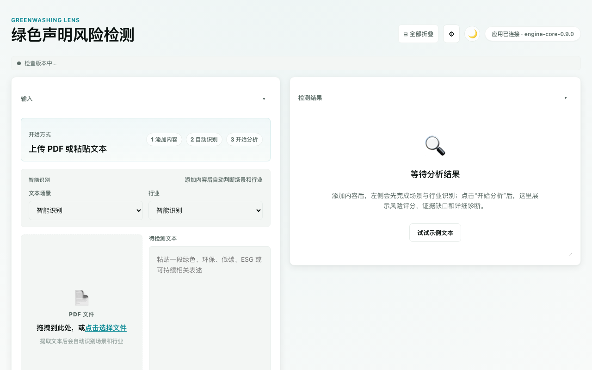
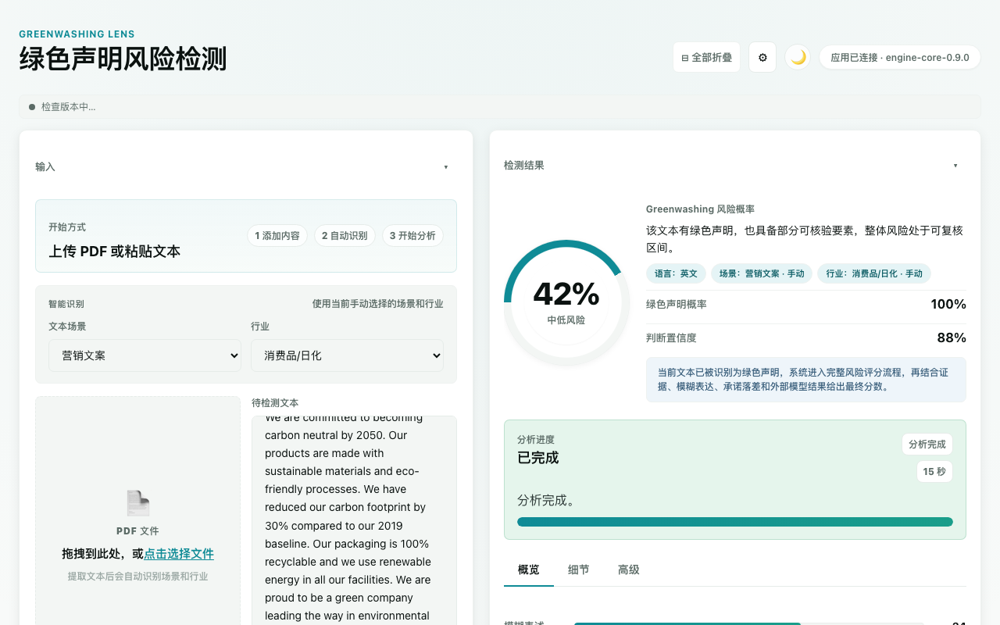
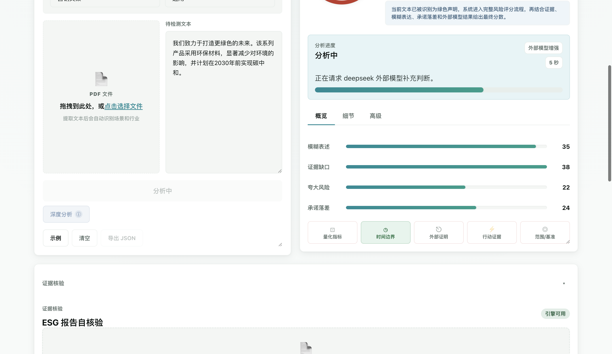
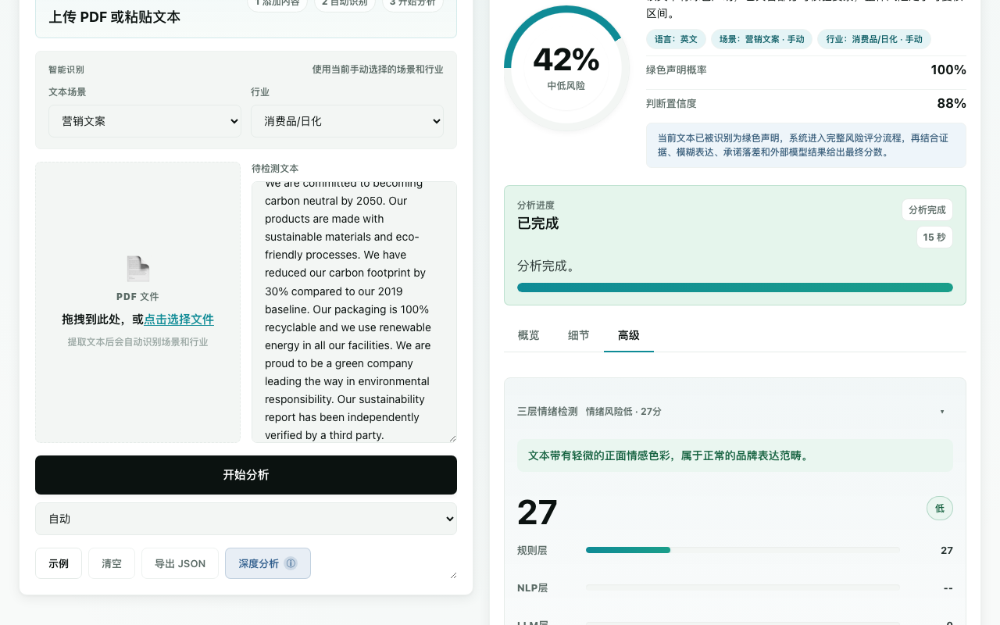
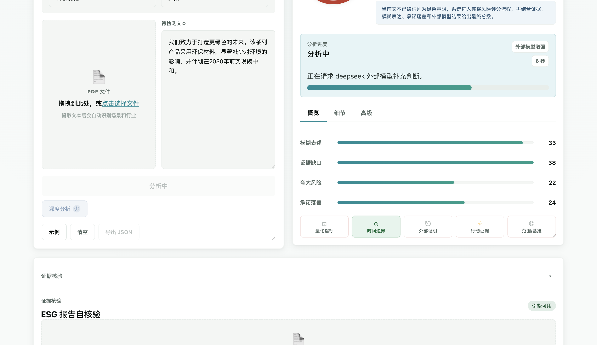
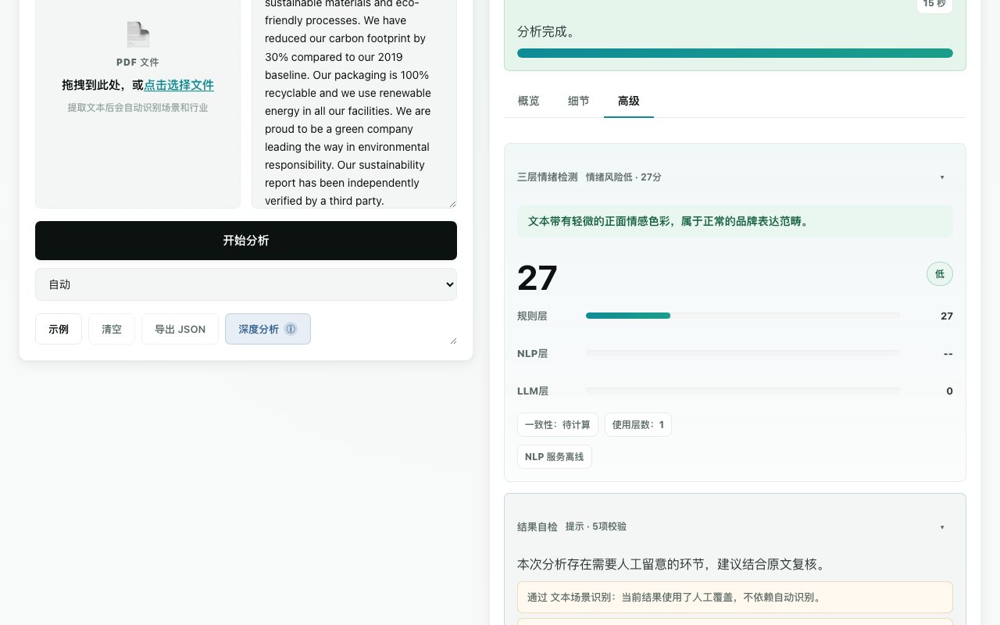
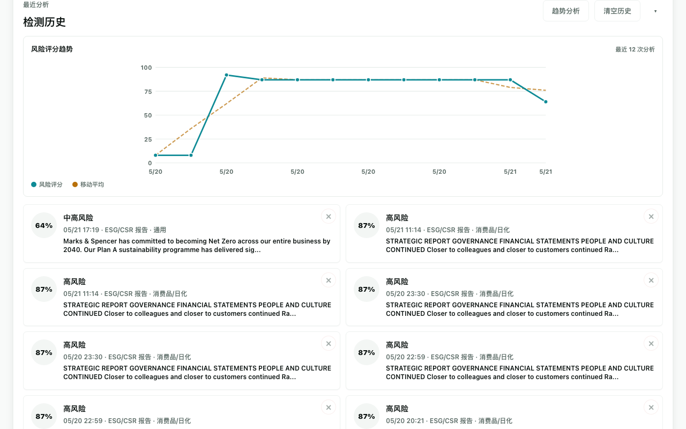
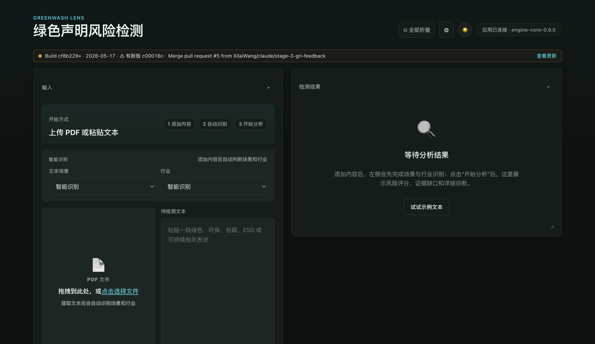
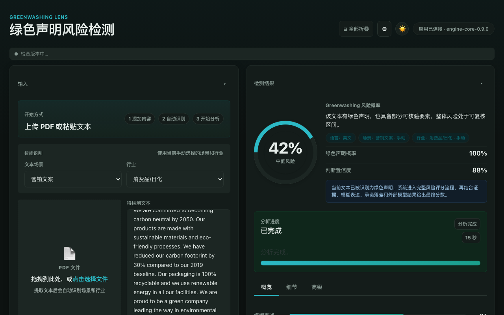

# Greenwash Lens

> **AI 驱动的企业绿色声明风险检测平台** —— 上传 ESG 报告或粘贴绿色营销文本，自动识别 greenwashing（洗绿）风险。基于学术金融语言学框架，结合规则引擎、NLP 情绪分析与多模型 LLM（OpenAI / Claude / Gemini / DeepSeek），提供从模糊表述检测到合规改写建议的全链路审计。支持中英文双语，打包为 Windows / macOS 桌面应用，双击即用。

Greenwash Lens 是一个支持中英文文本的 greenwashing 风险检测应用。现在它既可以作为开发用的本地 Web 服务运行，也可以打包成桌面应用：Windows 安装包（`.exe`）和 macOS 磁盘镜像（`.dmg`）。

当前版本：`0.9.0`

> **🚧 项目持续迭代中** —— 多项功能正在快速完善，包括证据核验引擎、多层级检测模型与合规报告导出。欢迎感兴趣的伙伴交流探讨、提出建议或参与协作，请联系：**[xilai529@gmail.com](mailto:xilai529@gmail.com)**

## 这次升级后的形态

- 桌面壳：Electron 原生窗口，双击即可打开，不需要手动开浏览器
- 后端服务：内置 Express 风格 HTTP 服务，Electron 启动时自动绑定随机空闲端口
- 历史记录：SQLite，本地长期保存，默认保留 2 年
- 规则引擎：前后端共用一套 `src/engine-core.js`
- 外部模型：支持 `openai`、`claude`、`gemini`、`deepseek`
- NLP 子服务：可选 Python 服务，提供 Layer 2 情绪检测增强
- **证据核验引擎**：可选 Python 子服务（端口 5176），基于 Gemini File Search
  对上传的 ESG/CSR 报告做 L1-L4 流水线（索引 → 抽声明 → 多查询检索 → 裁定）。
  详见 [`evidence-engine/README.md`](evidence-engine/README.md)。

## 检测模型规划

完整的多层级检测模型设计见 [`docs/greenwash-detection-plan.md`](docs/greenwash-detection-plan.md)
（包含 greenwashing 概念调研、7 Sins / EU ECGT 监管对位、8 层架构、数据需求清单、实施路线图）。

### Stage 1 已落地的多层 API（`/api/v2/analyze`）

```bash
curl -X POST http://127.0.0.1:5173/api/v2/analyze \
  -H "Content-Type: application/json" \
  -d '{"text":"Scope 1 emissions cut 33% vs 2017 by 2030.","mode":"standard"}'
```

返回 per-claim 结构化数据：每个原子声明带 `features`（Layer 1 词典命中向量）+ `structure`（Layer 3 解析出的 metric/scope/baseline/time_horizon）。模式 `fast` 跳过 Layer 3（不打 LLM，~3 秒）；`standard` 全跑（~5 秒）。

v1 `/api/analyze` 保留不动，前端继续工作。等 Stage 2-3 完成后再做 UI 迁移。

## 功能展示 / Feature Screenshots

### 主界面 — 文本与 PDF 输入

*支持粘贴绿色声明文本或上传 PDF 报告，自动识别语言、场景与行业分类*

### 分析结果 — 风险评分与概要

*AI 驱动的 Greenwashing 风险概率评分（0–100%），包含模糊表述、证据缺口、夸大风险、承诺落差四个维度*

### 风险维度分解与证据标记

*四个风险维度的量化分解 + 五项证据指标（量化指标、时间边界、外部证明、行动证据、范围/基准）*

### 三层情绪检测

*规则引擎 + NLP + LLM 三层情绪融合检测，一致性校验，分歧预警*

### LLM 增强判断

*外部模型（支持 OpenAI / Claude / Gemini / DeepSeek）提供模糊表述诊断、逻辑矛盾检测与合规改写建议*

### 结果自检

*自动校验分析结果的一致性，包括自动识别可信度、外部模型幻觉检测等*

### 检测历史与趋势

*本地 SQLite 存储所有分析历史，支持风险评分趋势图与移动平均线*

### 暗色模式
  
*支持亮色/暗色模式一键切换，自动跟随系统偏好*

---

## 开发运行

先安装依赖，然后启动开发服务：

```bash
npm install
npm start
```

注意：项目路径中不要包含空格（如 `New project`），否则 native module 编译可能报错。建议使用 `greenwash-lens` 这样的目录名。

默认地址：

```text
http://127.0.0.1:5173
```

如果你想直接启动桌面窗口：

```bash
npm run desktop:start
```

## 打包桌面应用

生成打包目录（不产出安装包）：

```bash
npm run build
```

生成可分发安装包：

```bash
npm run package
```

输出目录：

```text
dist/
```

目标产物：

- Windows：NSIS 安装包（`.exe`）
- macOS：磁盘镜像（`.dmg`）

## 历史记录存储

开发模式下，如果没有 Electron，SQLite 默认放在项目目录：

```text
data/history.sqlite
```

桌面应用模式下，SQLite 会自动放到系统用户数据目录：

- macOS：`~/Library/Application Support/Greenwash Lens`
- Windows：`%APPDATA%\\Greenwash Lens`

首次启动时会自动尝试迁移旧版 `history.json` 数据。

## 项目结构

```text
electron/main.js                 桌面应用入口
public/                          前端界面与离线资源
src/api-router.js                API 路由
src/analysis-jobs.js             异步分析任务与 stalled 状态
src/engine-core.js               前后端共用评分核心
src/greenwash-engine.js          后端评分引擎封装
src/history-store.js             SQLite 历史存储
src/text-classifier.js           中英文语言/场景/行业识别
src/services/analysis-service.js 分析编排服务
src/services/llm-service.js      外部模型适配器
src/services/nlp-service-client.js Python NLP 子服务客户端
src/services/emotion-fusion.js   三层情绪分数融合
nlp-service/                     可选 Python NLP 子服务
server.js                        开发服务入口
scripts/generate-icon-png.js     PNG/ICO/ICNS 图标生成
test/engine.test.js              核心规则测试
```

## API 概览

- `GET /api/health`
- `GET /api/v1/health`
- `POST /api/analyze`
- `POST /api/v1/analyze`
- `POST /api/v1/classify`
- `POST /api/v1/llm/test`
- `POST /api/v1/analyze-jobs`
- `GET /api/v1/analyze-jobs/:id`
- `POST /api/v1/history/summary`
- `POST /api/v1/upload-pdf`
- `GET /api/history`
- `DELETE /api/history`

详细字段见：

- [API 文档](/Users/xilaiwang/Documents/New%20project/docs/API.md)
- [部署文档](/Users/xilaiwang/Documents/New%20project/docs/DEPLOYMENT.md)

## 外部模型配置

复制 `.env.example` 为 `.env`，再按需要填写：

```text
LLM_PROVIDER=deepseek
DEEPSEEK_API_KEY=...
DEEPSEEK_MODEL=deepseek-v4-flash
```

支持的 provider：

- `openai`
- `claude`
- `gemini`
- `deepseek`

如果没有配置外部模型，系统会继续使用本地规则引擎完成分析。

## 桌面应用如何配置 API key

桌面模式不会读取 `app.asar` 里的 `.env`。首次启动 Electron 应用时，程序会在系统用户数据目录自动生成一个 `.env` 模板，之后请直接编辑那个文件：

- macOS：`~/Library/Application Support/Greenwash Lens/.env`
- Windows：`%APPDATA%\\Greenwash Lens\\.env`

修改 `LLM_PROVIDER`、对应的 API key 和模型名后，重启桌面应用即可生效。

## NLP 子服务

NLP 子服务是可选增强，不启动时应用仍然可以正常运行，使用 Layer 1 规则引擎和 Layer 3 LLM。启动后，应用会自动接入 Layer 2，并在结果中显示“三层情绪检测”。

启动步骤：

```bash
cd nlp-service
pip install -r requirements.txt
python main.py
```

首次运行会下载约 500MB 模型，缓存位置是：

```text
~/.cache/huggingface/
```

保持 Python 子服务终端开着，然后正常启动主应用：

```bash
npm start
```

或：

```bash
npm run desktop:start
```

主应用会自动检测：

```text
http://127.0.0.1:5174
```
